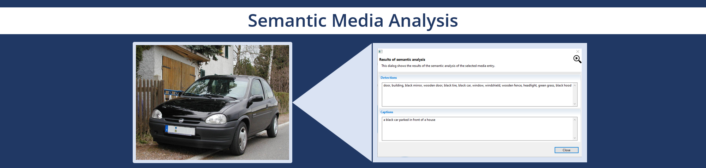
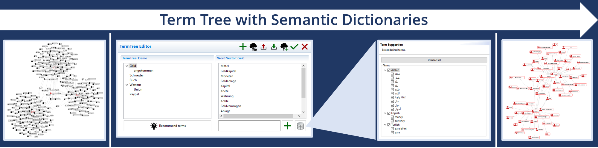
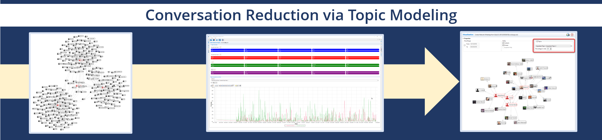
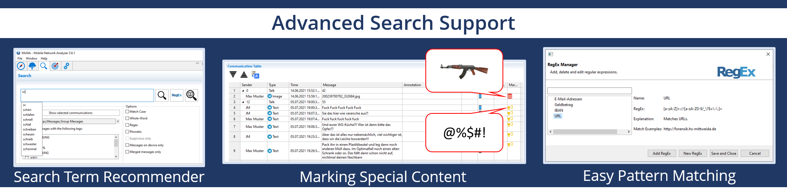

# The Mobile Network Analyzer (MoNA)
With MoNA, we present a platform for analysing mobile communication developed at Mittweida University of Applied Sciences in collaboration with various LEAs. MoNA integrates highly specialised AI services to support deep semantic analysis of communications across different channels and involving different modalities, such as video, images, audio, etc. The aim is to reduce the investigator's effort in searching for evidential information in networks. The core services such as Topic Modeling, Term Tree (Contextual Pattern Matcher), Author Profiling or Search Term Recommender are completely unsupervised, i.e. the analysis is based solely on data and no additional training is required.

## Semantic Media Analysis

## Term Tree with Semantic Dictionaries

## Conversation Reduction via Topic Modeling

## Advanced Search Support

## Publications

- Spranger, Michael, Florian Heinke, Luisa Appelt, Marcus Puder, und Dirk Labudde. 2016. "MoNA: Automated Identification of Evidence in Forensic Short Messages". International Journal On Advances in Security 9(1 & 2):14–24.
- Spranger, Michael, Jian Xi, Lukas Jaeckel, Jenny Felser, und Dirk Labudde. 2022. "MoNA: A Forensic Analysis Platform for Mobile Communication". KI - Künstliche Intelligenz 36(2):163–69. doi: 10.1007/s13218-022-00762-w.
- Felser, Jenny, Xi, Jian, Demus, Christoph, Labudde, Dirk, und Spranger, Michael. 2022. "Recommendation of Query Terms for Colloquial Texts in Forensic Text Analysis". INFORMATIK 2022 - Informatik in Den Naturwissenschaften P326. doi: 10.18420/INF2022_02.
