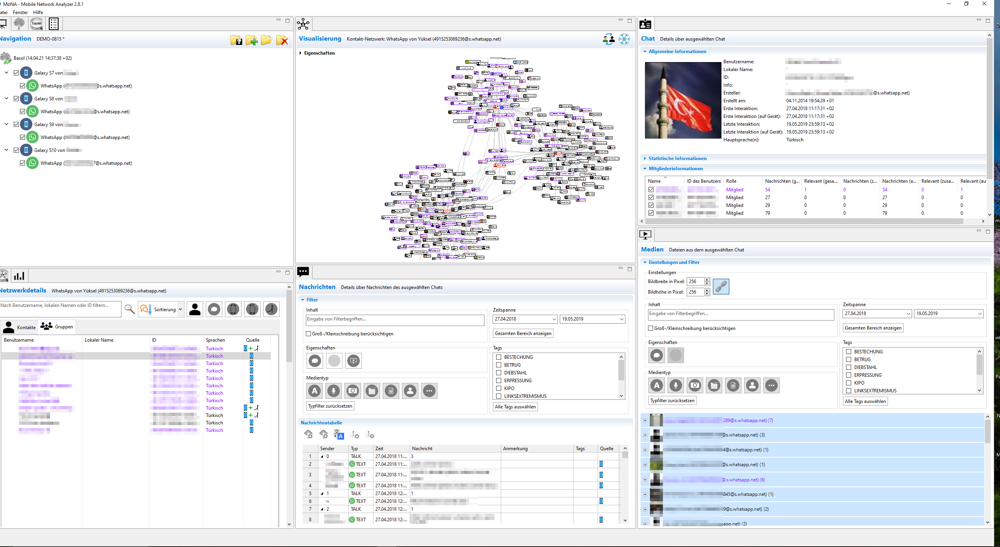

# The Mobile Network Analyser (MoNA)
With MoNA, we present a platform for analysing mobile communication developed at Mittweida University of Applied Sciences in collaboration with various LEAs. MoNA integrates highly specialised AI services to support deep semantic analysis of communications across different channels and involving different modalities, such as video, images, audio, etc. The aim is to reduce the investigator's effort in searching for evidential information in networks. The core services such as Topic Modeling, Term Tree (Contextual Pattern Matcher), Author Profiling or Search Term Recommender are completely unsupervised, i.e. the analysis is based solely on data and no additional training is required.

